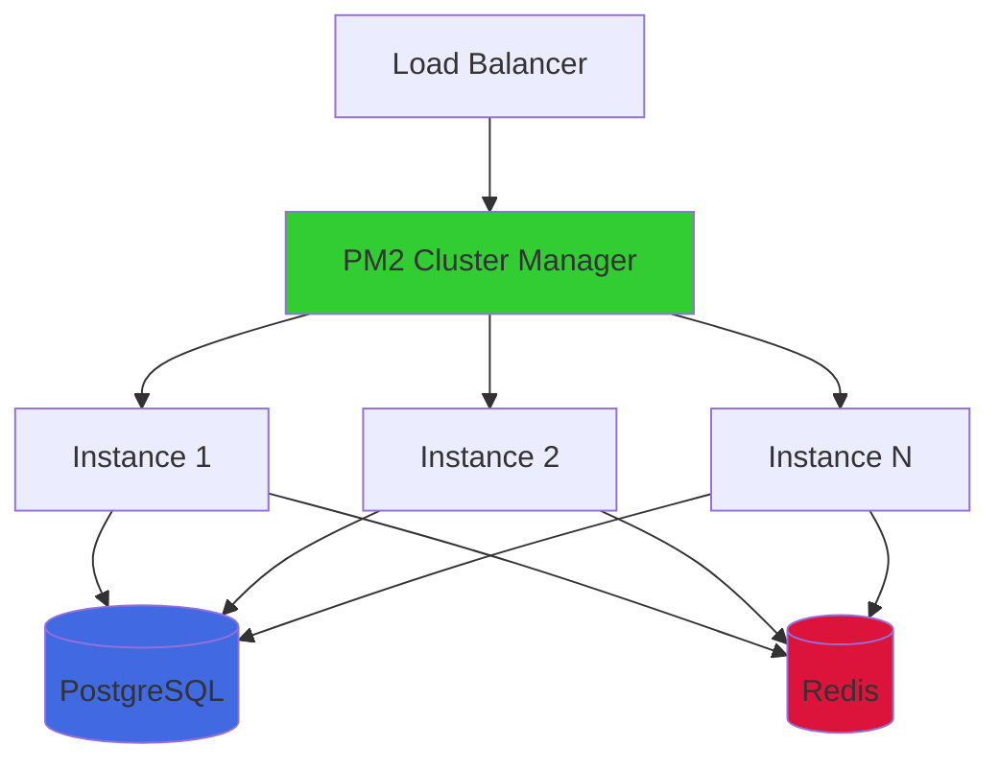

# Design Document: Production Scalability Migration

## Overview

This design outlines the migration from a file-based JSON database to a production-ready architecture using PostgreSQL for persistent storage and Redis for distributed caching and rate limiting. The migration maintains complete backward compatibility with existing API contracts while eliminating race conditions, enabling horizontal scaling, and improving performance under load.

The architecture follows a layered approach:
- **Data Layer**: PostgreSQL with connection pooling and transactions
- **Cache Layer**: Redis for distributed state and performance optimization
- **Application Layer**: Express.js with async operations and graceful shutdown
- **Process Layer**: PM2 cluster mode for multi-core utilization

## Architecture

### High-Level Architecture



### Data Flow

**Write Operations:**
1. Request arrives at load balancer
2. Routed to available instance
3. Rate limit checked in Redis
4. Data validated and sanitized
5. PostgreSQL transaction opened
6. Data written to database
7. Transaction committed
8. Cache invalidated in Redis
9. Response returned

**Read Operations:**
1. Request arrives at load balancer
2. Routed to available instance
3. Rate limit checked in Redis
4. Cache checked in Redis
5. If cache hit: return cached data
6. If cache miss: query PostgreSQL
7. Store result in Redis cache
8. Response returned

## Components and Interfaces

### 1. Database Connection Module (`db/connection.js`)

Manages PostgreSQL connection pooling and provides transaction support.

```javascript
const { Pool } = require('pg');

class DatabaseConnection {
  constructor(config) {
    this.pool = new Pool({
      connectionString: config.databaseUrl,
      max: config.poolSize || 20,
      idleTimeoutMillis: 30000,
      connectionTimeoutMillis: 5000,
      ssl: config.ssl ? { rejectUnauthorized: false } : false
    });
    
    this.pool.on('error', (err) => {
      console.error('Unexpected database error:', err);
    });
  }
  
  async query(text, params) {
    const start = Date.now();
    const result = await this.pool.query(text, params);
    const duration = Date.now() - start;
    console.log('Query executed', { text, duration, rows: result.rowCount });
    return result;
  }
  
  async transaction(callback) {
    const client = await this.pool.connect();
    try {
      await client.query('BEGIN');
      const result = await callback(client);
      await client.query('COMMIT');
      return result;
    } catch (error) {
      await client.query('ROLLBACK');
      throw error;
    } finally {
      client.release();
    }
  }
  
  async healthCheck() {
    try {
      const result = await this.pool.query('SELECT 1');
      return {
        healthy: true,
        totalConnections: this.pool.totalCount,
        idleConnections: this.pool.idleCount,
        waitingRequests: this.pool.waitingCount
      };
    } catch (error) {
      return { healthy: false, error: error.message };
    }
  }
  
  async close() {
    await this.pool.end();
  }
}

module.exports = { DatabaseConnection };
```

### 2. Redis Connection Module (`cache/connection.js`)

Manages Redis connection and provides caching utilities.

```javascript
const Redis = require('ioredis');

class CacheConnection {
  constructor(config) {
    this.client = new Redis(config.redisUrl, {
      maxRetriesPerRequest: 3,
      enableReadyCheck: true,
      lazyConnect: false,
      retryStrategy(times) {
        const delay = Math.min(times * 50, 2000);
        return delay;
      }
    });
    
    this.client.on('error', (err) => {
      console.error('Redis connection error:', err);
    });
    
    this.client.on('connect', () => {
      console.log('Redis connected');
    });
    
    this.defaultTTL = config.defaultTTL || 300; // 5 minutes
  }
  
  async get(key) {
    try {
      const value = await this.client.get(key);
      return value ? JSON.parse(value) : null;
    } catch (error) {
      console.error('Cache get error:', error);
      return null;
    }
  }
  
  async set(key, value, ttl = this.defaultTTL) {
    try {
      await this.client.setex(key, ttl, JSON.stringify(value));
      return true;
    } catch (error) {
      console.error('Cache set error:', error);
      return false;
    }
  }
  
  async del(key) {
    try {
      await this.client.del(key);
      return true;
    } catch (error) {
      console.error('Cache delete error:', error);
      return false;
    }
  }
  
  async healthCheck() {
    try {
      await this.client.ping();
      return { healthy: true };
    } catch (error) {
      return { healthy: false, error: error.message };
    }
  }
  
  async close() {
    await this.client.quit();
  }
}

module.exports = { CacheConnection };
```

### 3. User Repository (`db/repositories/userRepository.js`)

Encapsulates all user data access operations.

```javascript
class UserRepository {
  constructor(db, cache) {
    this.db = db;
    this.cache = cache;
  }
  
  async findByEmail(email) {
    const cacheKey = `user:email:${email}`;
    const cached = await this.cache.get(cacheKey);
    if (cached) return cached;
    
    const result = await this.db.query(
      'SELECT * FROM users WHERE email = $1',
      [email]
    );
    
    const user = result.rows[0] || null;
    if (user) {
      await this.cache.set(cacheKey, user);
    }
    return user;
  }
  
  async findById(id) {
    const cacheKey = `user:id:${id}`;
    const cached = await this.cache.get(cacheKey);
    if (cached) return cached;
    
    const result = await this.db.query(
      'SELECT * FROM users WHERE id = $1',
      [id]
    );
    
    const user = result.rows[0] || null;
    if (user) {
      await this.cache.set(cacheKey, user);
    }
    return user;
  }
  
  async create(userData) {
    return await this.db.transaction(async (client) => {
      const result = await client.query(
        `INSERT INTO users (name, email, password_hash, password_salt, auth_provider, 
         provider_user_id, profile, analytics, created_at, updated_at)
         VALUES ($1, $2, $3, $4, $5, $6, $7, $8, NOW(), NOW())
         RETURNING *`,
        [
          userData.name,
          userData.email,
          userData.passwordHash || null,
          userData.passwordSalt || null,
          userData.authProvider || null,
          userData.providerUserId || null,
          JSON.stringify(userData.profile || {}),
          JSON.stringify(userData.analytics || {})
        ]
      );
      
      const user = result.rows[0];
      await this.invalidateCache(user.id, user.email);
      return user;
    });
  }
  
  async update(id, updates) {
    return await this.db.transaction(async (client) => {
      const setClauses = [];
      const values = [];
      let paramIndex = 1;
      
      if (updates.name !== undefined) {
        setClauses.push(`name = $${paramIndex++}`);
        values.push(updates.name);
      }
      if (updates.profile !== undefined) {
        setClauses.push(`profile = $${paramIndex++}`);
        values.push(JSON.stringify(updates.profile));
      }
      if (updates.analytics !== undefined) {
        setClauses.push(`analytics = $${paramIndex++}`);
        values.push(JSON.stringify(updates.analytics));
      }
      
      setClauses.push(`updated_at = NOW()`);
      values.push(id);
      
      const result = await client.query(
        `UPDATE users SET ${setClauses.join(', ')} WHERE id = $${paramIndex} RETURNING *`,
        values
      );
      
      const user = result.rows[0];
      if (user) {
        await this.invalidateCache(user.id, user.email);
      }
      return user;
    });
  }
  
  async invalidateCache(userId, email) {
    await this.cache.del(`user:id:${userId}`);
    await this.cache.del(`user:email:${email}`);
  }
}

module.exports = { UserRepository };
```

### 4. Distributed Rate Limiter (`middleware/rateLimiter.js`)

Redis-based rate limiting that works across multiple instances.

```javascript
class DistributedRateLimiter {
  constructor(cache, options) {
    this.cache = cache;
    this.windowMs = options.windowMs;
    this.max = options.max;
    this.keyPrefix = options.keyPrefix;
  }
  
  middleware() {
    return async (req, res, next) => {
      const ip = req.ip || req.headers['x-forwarded-for'] || req.socket?.remoteAddress || 'unknown';
      const key = `ratelimit:${this.keyPrefix}:${ip}`;
      
      try {
        const current = await this.cache.client.incr(key);
        
        if (current === 1) {
          await this.cache.client.expire(key, Math.ceil(this.windowMs / 1000));
        }
        
        if (current > this.max) {
          const ttl = await this.cache.client.ttl(key);
          res.setHeader('Retry-After', String(Math.max(1, ttl)));
          return res.status(429).json({
            ok: false,
            code: 'RATE_LIMITED',
            message: 'Too many requests. Please retry later.'
          });
        }
        
        next();
      } catch (error) {
        console.error('Rate limiter error:', error);
        // Fail open - allow request if Redis is down
        next();
      }
    };
  }
}

module.exports = { DistributedRateLimiter };
```

### 5. Async Authentication Module (`auth/bcryptAuth.js`)

Non-blocking password hashing using bcrypt.

```javascript
const bcrypt = require('bcrypt');

class BcryptAuth {
  constructor(config) {
    this.saltRounds = config.saltRounds || 10;
  }
  
  async hashPassword(password) {
    const hash = await bcrypt.hash(password, this.saltRounds);
    return { hash, salt: null }; // bcrypt includes salt in hash
  }
  
  async verifyPassword(password, hash) {
    return await bcrypt.compare(password, hash);
  }
}

module.exports = { BcryptAuth };
```

### 6. Environment Validator (`config/validator.js`)

Validates required environment variables on startup.

```javascript
class ConfigValidator {
  static validate() {
    const errors = [];
    
    const authSecret = process.env.AUTH_SECRET;
    if (!authSecret || authSecret.length < 32) {
      errors.push('AUTH_SECRET must be at least 32 characters');
    }
    
    if (!process.env.DATABASE_URL) {
      errors.push('DATABASE_URL is required');
    }
    
    if (!process.env.REDIS_URL) {
      errors.push('REDIS_URL is required');
    }
    
    if (errors.length > 0) {
      console.error('Configuration validation failed:');
      errors.forEach(err => console.error(`  - ${err}`));
      process.exit(1);
    }
    
    return {
      authSecret,
      databaseUrl: process.env.DATABASE_URL,
      redisUrl: process.env.REDIS_URL,
      poolSize: parseInt(process.env.DB_POOL_SIZE || '20', 10),
      bcryptRounds: parseInt(process.env.BCRYPT_ROUNDS || '10', 10),
      cacheTTL: parseInt(process.env.CACHE_TTL || '300', 10)
    };
  }
}

module.exports = { ConfigValidator };
```

### 7. Migration Script (`scripts/migrate-data.js`)

Standalone script for migrating JSON data to PostgreSQL.

```javascript
const fs = require('fs/promises');
const path = require('path');
const { DatabaseConnection } = require('../db/connection');

class DataMigration {
  constructor(db, jsonPath) {
    this.db = db;
    this.jsonPath = jsonPath;
  }
  
  async backup() {
    const timestamp = new Date().toISOString().replace(/[:.]/g, '-');
    const backupPath = `${this.jsonPath}.backup-${timestamp}`;
    await fs.copyFile(this.jsonPath, backupPath);
    console.log(`Backup created: ${backupPath}`);
    return backupPath;
  }
  
  async loadJsonData() {
    const raw = await fs.readFile(this.jsonPath, 'utf8');
    const data = JSON.parse(raw);
    return data.users || [];
  }
  
  async migrate() {
    console.log('Starting migration...');
    
    const backupPath = await this.backup();
    const users = await this.loadJsonData();
    
    console.log(`Found ${users.length} users to migrate`);
    
    let migrated = 0;
    let errors = 0;
    
    await this.db.transaction(async (client) => {
      for (const user of users) {
        try {
          await client.query(
            `INSERT INTO users (id, name, email, password_hash, password_salt, 
             auth_provider, provider_user_id, profile, analytics, created_at, updated_at)
             VALUES ($1, $2, $3, $4, $5, $6, $7, $8, $9, $10, NOW())
             ON CONFLICT (email) DO NOTHING`,
            [
              user.id,
              user.name,
              user.email,
              user.passwordHash || null,
              user.passwordSalt || null,
              user.authProvider || null,
              user.providerUserId || null,
              JSON.stringify(user.profile || {}),
              JSON.stringify(user.analytics || {}),
              user.createdAt
            ]
          );
          migrated++;
        } catch (error) {
          console.error(`Failed to migrate user ${user.email}:`, error.message);
          errors++;
        }
      }
    });
    
    console.log(`Migration complete: ${migrated} users migrated, ${errors} errors`);
    console.log(`Backup saved to: ${backupPath}`);
    
    return { migrated, errors, backupPath };
  }
}

module.exports = { DataMigration };
```

### 8. Health Check Endpoint

Enhanced health check with dependency status.

```javascript
app.get('/api/health', async (req, res) => {
  const dbHealth = await db.healthCheck();
  const cacheHealth = await cache.healthCheck();
  
  const healthy = dbHealth.healthy && cacheHealth.healthy;
  const status = healthy ? 200 : 503;
  
  res.status(status).json({
    ok: healthy,
    timestamp: new Date().toISOString(),
    database: dbHealth,
    cache: cacheHealth,
    provider: AI_PROVIDER,
    model: process.env.GROQ_MODEL || process.env.BEDROCK_MODEL_ID || 'unknown'
  });
});
```

## Data Models

### PostgreSQL Schema

```sql
-- Users table
CREATE TABLE users (
  id UUID PRIMARY KEY DEFAULT gen_random_uuid(),
  name VARCHAR(80) NOT NULL,
  email VARCHAR(160) UNIQUE NOT NULL,
  password_hash VARCHAR(255),
  password_salt VARCHAR(255),
  auth_provider VARCHAR(20),
  provider_user_id VARCHAR(80),
  profile JSONB DEFAULT '{}',
  analytics JSONB DEFAULT '{"attempts":[],"questionsAsked":0,"proctorEvents":[],"badges":[]}',
  created_at TIMESTAMP WITH TIME ZONE DEFAULT NOW(),
  updated_at TIMESTAMP WITH TIME ZONE DEFAULT NOW()
);

-- Indexes for performance
CREATE INDEX idx_users_email ON users(email);
CREATE INDEX idx_users_provider ON users(auth_provider, provider_user_id);
CREATE INDEX idx_users_created_at ON users(created_at);

-- Function to update updated_at timestamp
CREATE OR REPLACE FUNCTION update_updated_at_column()
RETURNS TRIGGER AS $$
BEGIN
  NEW.updated_at = NOW();
  RETURN NEW;
END;
$$ LANGUAGE plpgsql;

-- Trigger to automatically update updated_at
CREATE TRIGGER update_users_updated_at
BEFORE UPDATE ON users
FOR EACH ROW
EXECUTE FUNCTION update_updated_at_column();
```

### Redis Key Patterns

```
# Rate limiting
ratelimit:auth:{ip}         -> counter (TTL: 10 minutes)
ratelimit:ai:{ip}           -> counter (TTL: 1 minute)
ratelimit:run:{ip}          -> counter (TTL: 1 minute)
ratelimit:voice:{ip}        -> counter (TTL: 1 minute)

# User caching
user:id:{userId}            -> JSON (TTL: 5 minutes)
user:email:{email}          -> JSON (TTL: 5 minutes)

# Analytics caching
analytics:dashboard:{userId} -> JSON (TTL: 5 minutes)
```

## Correctness Properties

*A property is a characteristic or behavior that should hold true across all valid executions of a system—essentially, a formal statement about what the system should do. Properties serve as the bridge between human-readable specifications and machine-verifiable correctness guarantees.*

### Property 1: Concurrent Write Safety

*For any* two concurrent write operations to the same user record, both operations should complete successfully without data loss, and the final state should reflect both changes or the last write should win consistently.

**Validates: Requirements 1.2**

### Property 2: Rate Limit Consistency

*For any* client making requests across multiple server instances, the total number of requests allowed within the rate limit window should not exceed the configured maximum, regardless of which instances handle the requests.

**Validates: Requirements 2.1, 6.5**

### Property 3: Cache Invalidation Correctness

*For any* write operation that modifies user data, all cache entries for that user should be invalidated, ensuring subsequent reads return the updated data.

**Validates: Requirements 2.4**

### Property 4: Transaction Atomicity

*For any* database transaction, either all operations within the transaction should succeed and be committed, or all operations should fail and be rolled back, with no partial state persisted.

**Validates: Requirements 1.2, 5.3**

### Property 5: Graceful Degradation

*For any* temporary Redis unavailability, the system should continue processing requests with degraded functionality (no caching, fallback rate limiting) rather than failing completely.

**Validates: Requirements 2.6**

### Property 6: Password Hashing Non-Blocking

*For any* authentication request, the password hashing operation should not block the Node.js event loop, allowing other requests to be processed concurrently.

**Validates: Requirements 3.2**

### Property 7: Environment Validation Fail-Fast

*For any* missing or invalid required environment variable, the system should fail to start and display a clear error message before accepting any requests.

**Validates: Requirements 4.1, 4.2, 4.3, 4.4**

### Property 8: Migration Data Integrity

*For any* user record in the JSON database, after successful migration, an equivalent record should exist in PostgreSQL with all fields preserved correctly.

**Validates: Requirements 5.2, 5.4**

### Property 9: API Backward Compatibility

*For any* existing API endpoint, the request and response format should remain unchanged after migration, ensuring existing clients continue to function.

**Validates: Requirements 8.1, 8.2**

### Property 10: Connection Pool Bounds

*For any* number of concurrent requests, the database connection pool should never exceed the configured maximum connections, and requests should queue when the pool is exhausted rather than failing.

**Validates: Requirements 1.3, 11.4**

## Error Handling

### Database Errors

- **Connection Failures**: Log error, return 503 Service Unavailable
- **Query Errors**: Log with context, rollback transaction, return 500 Internal Server Error
- **Constraint Violations**: Return 409 Conflict with specific error message
- **Timeout Errors**: Log warning, return 504 Gateway Timeout

### Redis Errors

- **Connection Failures**: Log warning, continue with degraded functionality
- **Operation Failures**: Log error, skip caching, proceed with database query
- **Rate Limit Failures**: Fail open (allow request), log error

### Migration Errors

- **Validation Errors**: Log specific record, continue with other records
- **Transaction Failures**: Rollback all changes, preserve original JSON file
- **Backup Failures**: Abort migration, display error message

### Authentication Errors

- **Invalid Credentials**: Return 401 Unauthorized
- **Token Expired**: Return 401 Unauthorized with specific error code
- **Hashing Errors**: Log error, return 500 Internal Server Error

## Testing Strategy

### Unit Tests

- Database connection and query execution
- Cache get/set/delete operations
- User repository CRUD operations
- Rate limiter counter logic
- Password hashing and verification
- Environment validation logic
- Migration data transformation

### Property-Based Tests

Property-based tests will use **fast-check** (for JavaScript/Node.js) with a minimum of 100 iterations per test.

Each property test must include a comment tag: **Feature: production-scalability-migration, Property {number}: {property_text}**

- **Property 1**: Generate concurrent write operations, verify no data loss
- **Property 2**: Generate requests across simulated instances, verify rate limit enforcement
- **Property 3**: Generate write operations, verify cache invalidation
- **Property 4**: Generate transaction scenarios with failures, verify atomicity
- **Property 5**: Simulate Redis failures, verify graceful degradation
- **Property 6**: Generate concurrent auth requests, verify non-blocking behavior
- **Property 7**: Generate invalid configurations, verify fail-fast behavior
- **Property 8**: Generate user records, migrate, verify data integrity
- **Property 9**: Generate API requests, verify response format compatibility
- **Property 10**: Generate concurrent requests exceeding pool size, verify queuing

### Integration Tests

- End-to-end user registration and login flow
- Concurrent user operations across multiple instances
- Rate limiting across multiple instances
- Cache hit/miss scenarios
- Database failover and recovery
- Redis failover and recovery
- Migration script execution
- Health check endpoint responses

### Load Tests

- 100+ concurrent users
- Sustained load for 10 minutes
- Measure response times (p50, p95, p99)
- Measure connection pool utilization
- Measure cache hit rate
- Verify no memory leaks
- Verify graceful degradation under extreme load
