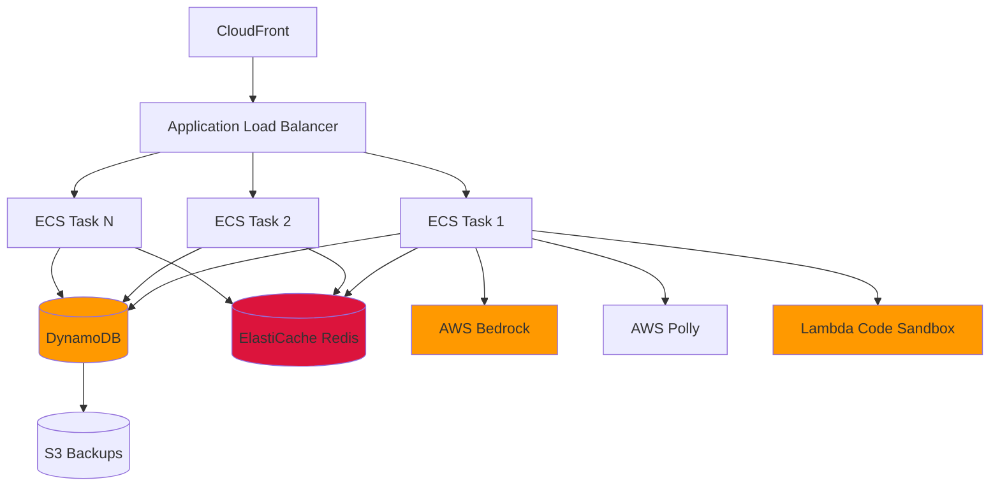
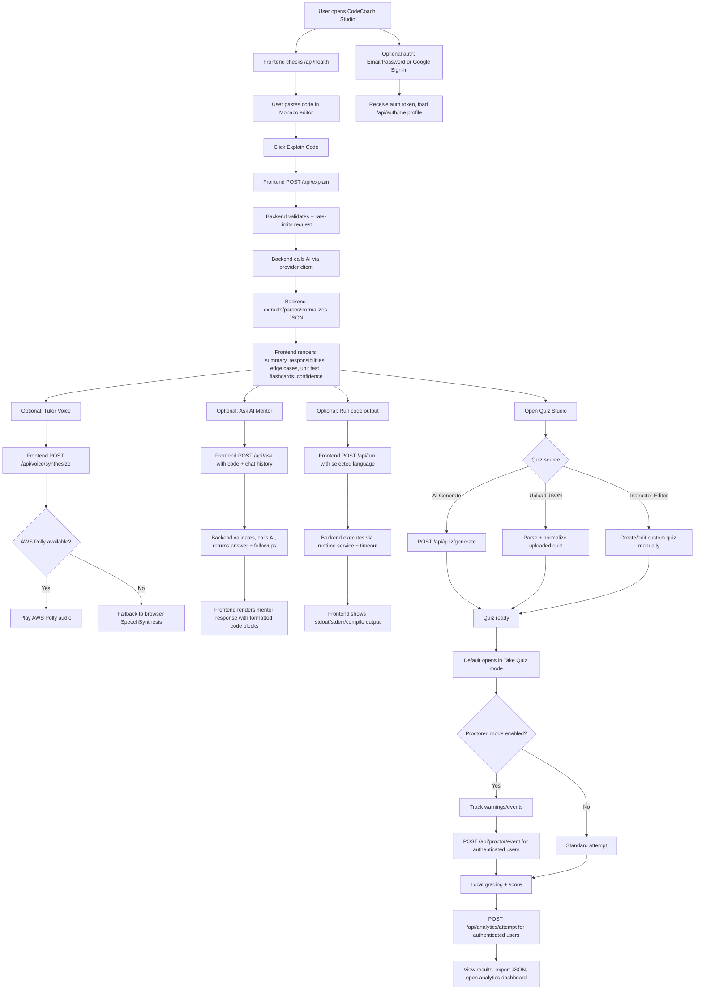

# Design Document: 

## Introduction

 CodeCoachStudiois an AI-powered platform that explains code in simple, multilinguallanguage and guides learners step-by-step.
 
-  It combinescode explanation, doubt-solving, flashcard revision, and quiz practice in one unified studio.
-  Instructors and students can generate, upload, or manually create quizzes with instant scoring and optional proctored mode.
-  The goal is to improve "concept clarity, revision, and interview readiness" through interactive, AI-assisted learning.

## Overview

This design outlines the migration from a file-based JSON database to a production-ready serverless architecture using Amazon DynamoDB for persistent storage and Amazon ElastiCache (Redis) for distributed caching and rate limiting. The migration maintains complete backward compatibility with existing API contracts while eliminating race conditions, enabling horizontal scaling, and improving performance under load.

The architecture follows a serverless-first approach:
- **Data Layer**: Amazon DynamoDB with on-demand billing and conditional writes
- **Cache Layer**: Amazon ElastiCache Redis for distributed state and performance optimization
- **Application Layer**: Express.js on ECS Fargate with async operations and graceful shutdown
- **Compute Layer**: AWS Lambda for isolated code execution sandbox
- **AI Layer**: AWS Bedrock Claude 3 Sonnet and AWS Polly for voice synthesis

## Architecture

### High-Level Architecture




### Data Flow

**Write Operations:**
1. Request arrives at Application Load Balancer
2. Routed to available ECS task
3. Rate limit checked in Redis (INCR command)
4. Data validated and sanitized
5. DynamoDB PutItem with ConditionExpression to prevent duplicates
6. Cache invalidated in Redis (DEL command)
7. Response returned

**Read Operations:**
1. Request arrives at Application Load Balancer
2. Routed to available ECS task
3. Rate limit checked in Redis
4. Cache checked in Redis (GET command)
5. If cache hit: return cached data
6. If cache miss: DynamoDB GetItem or Query
7. Store result in Redis cache (SETEX command)
8. Response returned

**Analytics Write with DynamoDB Streams:**
1. User completes quiz attempt
2. DynamoDB UpdateItem adds attempt to Analytics table
3. DynamoDB Streams captures change
4. Lambda function triggered with change record
5. Lambda aggregates statistics and updates badges
6. Lambda writes back to DynamoDB Users table

###FLOWCHART:



## Components and Interfaces

### 1. DynamoDB Connection Module (`db/dynamodb.js`)

Manages DynamoDB client and provides operation wrappers.

```javascript
const { DynamoDBClient } = require('@aws-sdk/client-dynamodb');
const { DynamoDBDocumentClient, GetCommand, PutCommand, UpdateCommand, 
        QueryCommand, BatchWriteCommand } = require('@aws-sdk/lib-dynamodb');

class DynamoDBConnection {
  constructor(config) {
    const client = new DynamoDBClient({
      region: config.region,
      maxAttempts: 3,
      retryMode: 'adaptive'
    });
    
    this.docClient = DynamoDBDocumentClient.from(client, {
      marshallOptions: {
        removeUndefinedValues: true,
        convertClassInstanceToMap: true
      }
    });
    
    this.tables = {
      users: config.usersTable || 'CodeCoach-Users',
      analytics: config.analyticsTable || 'CodeCoach-Analytics',
      sessions: config.sessionsTable || 'CodeCoach-Sessions'
    };
  }
  
  async get(tableName, key) {
    const start = Date.now();
    try {
      const result = await this.docClient.send(new GetCommand({
        TableName: tableName,
        Key: key
      }));
      const duration = Date.now() - start;
      console.log('DynamoDB GetItem', { tableName, duration, found: !!result.Item });
      return result.Item || null;
    } catch (error) {
      console.error('DynamoDB GetItem error:', error);
      throw error;
    }
  }
  
  async put(tableName, item, conditionExpression = null) {
    const start = Date.now();
    try {
      const params = {
        TableName: tableName,
        Item: item
      };
      
      if (conditionExpression) {
        params.ConditionExpression = conditionExpression;
      }
      
      await this.docClient.send(new PutCommand(params));
      const duration = Date.now() - start;
      console.log('DynamoDB PutItem', { tableName, duration });
      return item;
    } catch (error) {
      if (error.name === 'ConditionalCheckFailedException') {
        console.warn('DynamoDB conditional write failed:', { tableName, item });
      } else {
        console.error('DynamoDB PutItem error:', error);
      }
      throw error;
    }
  }
  
  async update(tableName, key, updateExpression, expressionAttributeValues) {
    const start = Date.now();
    try {
      const result = await this.docClient.send(new UpdateCommand({
        TableName: tableName,
        Key: key,
        UpdateExpression: updateExpression,
        ExpressionAttributeValues: expressionAttributeValues,
        ReturnValues: 'ALL_NEW'
      }));
      const duration = Date.now() - start;
      console.log('DynamoDB UpdateItem', { tableName, duration });
      return result.Attributes;
    } catch (error) {
      console.error('DynamoDB UpdateItem error:', error);
      throw error;
    }
  }
  
  async query(tableName, keyConditionExpression, expressionAttributeValues, indexName = null) {
    const start = Date.now();
    try {
      const params = {
        TableName: tableName,
        KeyConditionExpression: keyConditionExpression,
        ExpressionAttributeValues: expressionAttributeValues
      };
      
      if (indexName) {
        params.IndexName = indexName;
      }
      
      const result = await this.docClient.send(new QueryCommand(params));
      const duration = Date.now() - start;
      console.log('DynamoDB Query', { tableName, indexName, duration, count: result.Items.length });
      return result.Items;
    } catch (error) {
      console.error('DynamoDB Query error:', error);
      throw error;
    }
  }
  
  async batchWrite(tableName, items) {
    const start = Date.now();
    const batches = [];
    
    // DynamoDB BatchWriteItem limit is 25 items
    for (let i = 0; i < items.length; i += 25) {
      batches.push(items.slice(i, i + 25));
    }
    
    let written = 0;
    for (const batch of batches) {
      try {
        await this.docClient.send(new BatchWriteCommand({
          RequestItems: {
            [tableName]: batch.map(item => ({
              PutRequest: { Item: item }
            }))
          }
        }));
        written += batch.length;
      } catch (error) {
        console.error('DynamoDB BatchWriteItem error:', error);
        throw error;
      }
    }
    
    const duration = Date.now() - start;
    console.log('DynamoDB BatchWrite', { tableName, duration, written });
    return written;
  }
  
  async healthCheck() {
    try {
      const { DescribeTableCommand } = require('@aws-sdk/client-dynamodb');
      await this.docClient.send(new DescribeTableCommand({
        TableName: this.tables.users
      }));
      return { healthy: true };
    } catch (error) {
      return { healthy: false, error: error.message };
    }
  }
}

module.exports = { DynamoDBConnection };
```


### 2. Redis Connection Module (`cache/connection.js`)

Manages Redis connection and provides caching utilities.

```javascript
const Redis = require('ioredis');

class CacheConnection {
  constructor(config) {
    this.client = new Redis(config.redisUrl, {
      maxRetriesPerRequest: 3,
      enableReadyCheck: true,
      lazyConnect: false,
      retryStrategy(times) {
        const delay = Math.min(times * 50, 2000);
        return delay;
      }
    });
    
    this.client.on('error', (err) => {
      console.error('Redis connection error:', err);
    });
    
    this.client.on('connect', () => {
      console.log('Redis connected');
    });
    
    this.defaultTTL = config.defaultTTL || 300; // 5 minutes
  }
  
  async get(key) {
    try {
      const value = await this.client.get(key);
      return value ? JSON.parse(value) : null;
    } catch (error) {
      console.error('Cache get error:', error);
      return null;
    }
  }
  
  async set(key, value, ttl = this.defaultTTL) {
    try {
      await this.client.setex(key, ttl, JSON.stringify(value));
      return true;
    } catch (error) {
      console.error('Cache set error:', error);
      return false;
    }
  }
  
  async del(key) {
    try {
      await this.client.del(key);
      return true;
    } catch (error) {
      console.error('Cache delete error:', error);
      return false;
    }
  }
  
  async healthCheck() {
    try {
      await this.client.ping();
      return { healthy: true };
    } catch (error) {
      return { healthy: false, error: error.message };
    }
  }
  
  async close() {
    await this.client.quit();
  }
}

module.exports = { CacheConnection };
```

### 3. User Repository (`db/repositories/userRepository.js`)

Encapsulates all user data access operations using DynamoDB.

```javascript
const { v4: uuidv4 } = require('uuid');

class UserRepository {
  constructor(db, cache) {
    this.db = db;
    this.cache = cache;
    this.tableName = db.tables.users;
  }
  
  async findByEmail(email) {
    const cacheKey = `user:email:${email}`;
    const cached = await this.cache.get(cacheKey);
    if (cached) return cached;
    
    // Query using GSI on email
    const items = await this.db.query(
      this.tableName,
      'email = :email',
      { ':email': email },
      'EmailIndex'
    );
    
    const user = items[0] || null;
    if (user) {
      await this.cache.set(cacheKey, user);
    }
    return user;
  }
  
  async findById(id) {
    const cacheKey = `user:id:${id}`;
    const cached = await this.cache.get(cacheKey);
    if (cached) return cached;
    
    const user = await this.db.get(this.tableName, { userId: id });
    
    if (user) {
      await this.cache.set(cacheKey, user);
    }
    return user;
  }
  
  async create(userData) {
    const user = {
      userId: uuidv4(),
      name: userData.name,
      email: userData.email,
      passwordHash: userData.passwordHash || null,
      passwordSalt: userData.passwordSalt || null,
      authProvider: userData.authProvider || null,
      providerUserId: userData.providerUserId || null,
      profile: userData.profile || {},
      analytics: userData.analytics || {
        attempts: [],
        questionsAsked: 0,
        proctorEvents: [],
        badges: []
      },
      createdAt: new Date().toISOString(),
      updatedAt: new Date().toISOString()
    };
    
    // Prevent duplicate email registration using conditional write
    await this.db.put(
      this.tableName,
      user,
      'attribute_not_exists(email)'
    );
    
    await this.invalidateCache(user.userId, user.email);
    return user;
  }
  
  async update(id, updates) {
    const updateParts = [];
    const values = {};
    
    if (updates.name !== undefined) {
      updateParts.push('name = :name');
      values[':name'] = updates.name;
    }
    if (updates.profile !== undefined) {
      updateParts.push('profile = :profile');
      values[':profile'] = updates.profile;
    }
    if (updates.analytics !== undefined) {
      updateParts.push('analytics = :analytics');
      values[':analytics'] = updates.analytics;
    }
    
    updateParts.push('updatedAt = :updatedAt');
    values[':updatedAt'] = new Date().toISOString();
    
    const updateExpression = 'SET ' + updateParts.join(', ');
    
    const user = await this.db.update(
      this.tableName,
      { userId: id },
      updateExpression,
      values
    );
    
    if (user) {
      await this.invalidateCache(user.userId, user.email);
    }
    return user;
  }
  
  async invalidateCache(userId, email) {
    await this.cache.del(`user:id:${userId}`);
    await this.cache.del(`user:email:${email}`);
  }
}

module.exports = { UserRepository };
```


### 4. Distributed Rate Limiter (`middleware/rateLimiter.js`)

Redis-based rate limiting that works across multiple ECS tasks.

```javascript
class DistributedRateLimiter {
  constructor(cache, options) {
    this.cache = cache;
    this.windowMs = options.windowMs;
    this.max = options.max;
    this.keyPrefix = options.keyPrefix;
  }
  
  middleware() {
    return async (req, res, next) => {
      const ip = req.ip || req.headers['x-forwarded-for'] || req.socket?.remoteAddress || 'unknown';
      const key = `ratelimit:${this.keyPrefix}:${ip}`;
      
      try {
        const current = await this.cache.client.incr(key);
        
        if (current === 1) {
          await this.cache.client.expire(key, Math.ceil(this.windowMs / 1000));
        }
        
        if (current > this.max) {
          const ttl = await this.cache.client.ttl(key);
          res.setHeader('Retry-After', String(Math.max(1, ttl)));
          return res.status(429).json({
            ok: false,
            code: 'RATE_LIMITED',
            message: 'Too many requests. Please retry later.'
          });
        }
        
        next();
      } catch (error) {
        console.error('Rate limiter error:', error);
        // Fail open - allow request if Redis is down
        next();
      }
    };
  }
}

module.exports = { DistributedRateLimiter };
```

### 5. Async Authentication Module (`auth/bcryptAuth.js`)

Non-blocking password hashing using bcrypt.

```javascript
const bcrypt = require('bcrypt');

class BcryptAuth {
  constructor(config) {
    this.saltRounds = config.saltRounds || 10;
  }
  
  async hashPassword(password) {
    const hash = await bcrypt.hash(password, this.saltRounds);
    return { hash, salt: null }; // bcrypt includes salt in hash
  }
  
  async verifyPassword(password, hash) {
    return await bcrypt.compare(password, hash);
  }
}

module.exports = { BcryptAuth };
```

### 6. Environment Validator (`config/validator.js`)

Validates required environment variables on startup.

```javascript
class ConfigValidator {
  static validate() {
    const errors = [];
    
    const authSecret = process.env.AUTH_SECRET;
    if (!authSecret || authSecret.length < 32) {
      errors.push('AUTH_SECRET must be at least 32 characters');
    }
    
    if (!process.env.AWS_REGION) {
      errors.push('AWS_REGION is required');
    }
    
    if (!process.env.REDIS_URL) {
      errors.push('REDIS_URL is required');
    }
    
    if (!process.env.DYNAMODB_USERS_TABLE) {
      errors.push('DYNAMODB_USERS_TABLE is required');
    }
    
    if (!process.env.DYNAMODB_ANALYTICS_TABLE) {
      errors.push('DYNAMODB_ANALYTICS_TABLE is required');
    }
    
    if (!process.env.DYNAMODB_SESSIONS_TABLE) {
      errors.push('DYNAMODB_SESSIONS_TABLE is required');
    }
    
    if (errors.length > 0) {
      console.error('Configuration validation failed:');
      errors.forEach(err => console.error(`  - ${err}`));
      process.exit(1);
    }
    
    return {
      authSecret,
      awsRegion: process.env.AWS_REGION,
      redisUrl: process.env.REDIS_URL,
      usersTable: process.env.DYNAMODB_USERS_TABLE,
      analyticsTable: process.env.DYNAMODB_ANALYTICS_TABLE,
      sessionsTable: process.env.DYNAMODB_SESSIONS_TABLE,
      bcryptRounds: parseInt(process.env.BCRYPT_ROUNDS || '10', 10),
      cacheTTL: parseInt(process.env.CACHE_TTL || '300', 10)
    };
  }
}

module.exports = { ConfigValidator };
```


### 7. Migration Script (`scripts/migrate-data.js`)

Standalone script for migrating JSON data to DynamoDB.

```javascript
const fs = require('fs/promises');
const path = require('path');
const { DynamoDBConnection } = require('../db/dynamodb');
const { v4: uuidv4 } = require('uuid');

class DataMigration {
  constructor(db, jsonPath) {
    this.db = db;
    this.jsonPath = jsonPath;
  }
  
  async backup() {
    const timestamp = new Date().toISOString().replace(/[:.]/g, '-');
    const backupPath = `${this.jsonPath}.backup-${timestamp}`;
    await fs.copyFile(this.jsonPath, backupPath);
    console.log(`Backup created: ${backupPath}`);
    return backupPath;
  }
  
  async loadJsonData() {
    const raw = await fs.readFile(this.jsonPath, 'utf8');
    const data = JSON.parse(raw);
    return data.users || [];
  }
  
  transformUser(user) {
    return {
      userId: user.id || uuidv4(),
      name: user.name,
      email: user.email,
      passwordHash: user.passwordHash || null,
      passwordSalt: user.passwordSalt || null,
      authProvider: user.authProvider || null,
      providerUserId: user.providerUserId || null,
      profile: user.profile || {},
      analytics: user.analytics || {
        attempts: [],
        questionsAsked: 0,
        proctorEvents: [],
        badges: []
      },
      createdAt: user.createdAt || new Date().toISOString(),
      updatedAt: new Date().toISOString()
    };
  }
  
  async migrate() {
    console.log('Starting migration...');
    
    const backupPath = await this.backup();
    const users = await this.loadJsonData();
    
    console.log(`Found ${users.length} users to migrate`);
    
    const transformedUsers = users.map(u => this.transformUser(u));
    
    let migrated = 0;
    let errors = 0;
    
    try {
      // Use BatchWriteItem for efficient bulk writes
      migrated = await this.db.batchWrite(this.db.tables.users, transformedUsers);
    } catch (error) {
      console.error('Batch migration failed, falling back to individual writes:', error);
      
      // Fallback: write individually
      for (const user of transformedUsers) {
        try {
          await this.db.put(this.db.tables.users, user);
          migrated++;
        } catch (error) {
          console.error(`Failed to migrate user ${user.email}:`, error.message);
          errors++;
        }
      }
    }
    
    console.log(`Migration complete: ${migrated} users migrated, ${errors} errors`);
    console.log(`Backup saved to: ${backupPath}`);
    
    return { migrated, errors, backupPath };
  }
}

module.exports = { DataMigration };
```

### 8. Health Check Endpoint

Enhanced health check with dependency status.

```javascript
app.get('/api/health', async (req, res) => {
  const dbHealth = await db.healthCheck();
  const cacheHealth = await cache.healthCheck();
  
  const healthy = dbHealth.healthy && cacheHealth.healthy;
  const status = healthy ? 200 : 503;
  
  res.status(status).json({
    ok: healthy,
    timestamp: new Date().toISOString(),
    database: dbHealth,
    cache: cacheHealth,
    provider: AI_PROVIDER,
    model: process.env.GROQ_MODEL || process.env.BEDROCK_MODEL_ID || 'unknown'
  });
});
```

### 9. Lambda Code Execution Handler (`lambda/codeExecutor.js`)

AWS Lambda function for isolated code execution.

```javascript
exports.handler = async (event) => {
  const { code, language, testCases } = JSON.parse(event.body);
  
  try {
    let result;
    
    switch (language) {
      case 'javascript':
        result = executeJavaScript(code, testCases);
        break;
      case 'python':
        result = await executePython(code, testCases);
        break;
      default:
        throw new Error(`Unsupported language: ${language}`);
    }
    
    return {
      statusCode: 200,
      body: JSON.stringify({
        ok: true,
        output: result.output,
        passed: result.passed,
        executionTime: result.executionTime
      })
    };
  } catch (error) {
    return {
      statusCode: 500,
      body: JSON.stringify({
        ok: false,
        error: error.message
      })
    };
  }
};

function executeJavaScript(code, testCases) {
  const vm = require('vm');
  const sandbox = { console: { log: () => {} }, testCases };
  const script = new vm.Script(code);
  const context = vm.createContext(sandbox);
  
  const start = Date.now();
  script.runInContext(context, { timeout: 5000 });
  const executionTime = Date.now() - start;
  
  return {
    output: 'Execution completed',
    passed: true,
    executionTime
  };
}
```


## Data Models

### DynamoDB Table Schemas

#### Users Table

```javascript
{
  TableName: 'CodeCoach-Users',
  KeySchema: [
    { AttributeName: 'userId', KeyType: 'HASH' }  // Partition key
  ],
  AttributeDefinitions: [
    { AttributeName: 'userId', AttributeType: 'S' },
    { AttributeName: 'email', AttributeType: 'S' }
  ],
  GlobalSecondaryIndexes: [
    {
      IndexName: 'EmailIndex',
      KeySchema: [
        { AttributeName: 'email', KeyType: 'HASH' }
      ],
      Projection: { ProjectionType: 'ALL' }
    }
  ],
  BillingMode: 'PAY_PER_REQUEST',
  PointInTimeRecoverySpecification: { PointInTimeRecoveryEnabled: true }
}

// Item structure:
{
  userId: 'uuid-v4',
  name: 'John Doe',
  email: 'john@example.com',
  passwordHash: 'bcrypt-hash' | null,
  passwordSalt: null,  // bcrypt includes salt in hash
  authProvider: 'google' | 'email' | null,
  providerUserId: 'google-user-id' | null,
  profile: {
    avatar: 'url',
    preferences: {}
  },
  analytics: {
    attempts: [],
    questionsAsked: 0,
    proctorEvents: [],
    badges: []
  },
  createdAt: '2024-03-04T10:00:00.000Z',
  updatedAt: '2024-03-04T10:00:00.000Z'
}
```

#### Analytics Table

```javascript
{
  TableName: 'CodeCoach-Analytics',
  KeySchema: [
    { AttributeName: 'userId', KeyType: 'HASH' },      // Partition key
    { AttributeName: 'timestamp', KeyType: 'RANGE' }   // Sort key
  ],
  AttributeDefinitions: [
    { AttributeName: 'userId', AttributeType: 'S' },
    { AttributeName: 'timestamp', AttributeType: 'N' }
  ],
  StreamSpecification: {
    StreamEnabled: true,
    StreamViewType: 'NEW_AND_OLD_IMAGES'
  },
  BillingMode: 'PAY_PER_REQUEST'
}

// Item structure:
{
  userId: 'uuid-v4',
  timestamp: 1709550000000,  // Unix timestamp in milliseconds
  eventType: 'quiz_attempt' | 'question_asked' | 'code_executed',
  data: {
    quizId: 'quiz-id',
    score: 85,
    duration: 120,
    language: 'javascript'
  }
}
```

#### Sessions Table

```javascript
{
  TableName: 'CodeCoach-Sessions',
  KeySchema: [
    { AttributeName: 'sessionId', KeyType: 'HASH' }  // Partition key
  ],
  AttributeDefinitions: [
    { AttributeName: 'sessionId', AttributeType: 'S' }
  ],
  TimeToLiveSpecification: {
    Enabled: true,
    AttributeName: 'ttl'
  },
  BillingMode: 'PAY_PER_REQUEST'
}

// Item structure:
{
  sessionId: 'uuid-v4',
  userId: 'uuid-v4',
  token: 'jwt-token',
  createdAt: '2024-03-04T10:00:00.000Z',
  ttl: 1709636400  // Unix timestamp (24 hours from creation)
}
```

### Redis Key Patterns

```
# Rate limiting
ratelimit:auth:{ip}         -> counter (TTL: 10 minutes)
ratelimit:ai:{ip}           -> counter (TTL: 1 minute)
ratelimit:run:{ip}          -> counter (TTL: 1 minute)
ratelimit:voice:{ip}        -> counter (TTL: 1 minute)

# User caching
user:id:{userId}            -> JSON (TTL: 5 minutes)
user:email:{email}          -> JSON (TTL: 5 minutes)

# Analytics caching
analytics:dashboard:{userId} -> JSON (TTL: 5 minutes)
```


## Correctness Properties

*A property is a characteristic or behavior that should hold true across all valid executions of a system—essentially, a formal statement about what the system should do. Properties serve as the bridge between human-readable specifications and machine-verifiable correctness guarantees.*

### Property 1: Concurrent Write Safety

*For any* two concurrent write operations to the same user record, DynamoDB conditional writes should prevent duplicate registrations, and UpdateItem operations should apply both changes or the last write should win consistently without data loss.

**Validates: Requirements 1.2, 2.5**

### Property 2: Rate Limit Consistency

*For any* client making requests across multiple ECS tasks, the total number of requests allowed within the rate limit window should not exceed the configured maximum, regardless of which tasks handle the requests.

**Validates: Requirements 3.1, 3.7**

### Property 3: Cache Invalidation Correctness

*For any* write operation that modifies user data in DynamoDB, all cache entries for that user should be invalidated in Redis, ensuring subsequent reads return the updated data.

**Validates: Requirements 3.4**

### Property 4: DynamoDB Conditional Write Atomicity

*For any* user registration attempt with an existing email, the DynamoDB PutItem operation with ConditionExpression 'attribute_not_exists(email)' should fail with ConditionalCheckFailedException, preventing duplicate accounts.

**Validates: Requirements 1.2, 2.5**

### Property 5: Graceful Degradation

*For any* temporary Redis unavailability, the system should continue processing requests with degraded functionality (no caching, fallback rate limiting) rather than failing completely.

**Validates: Requirements 3.6**

### Property 6: Password Hashing Non-Blocking

*For any* authentication request, the bcrypt password hashing operation should not block the Node.js event loop, allowing other requests to be processed concurrently.

**Validates: Requirements 4.1, 4.2, 4.4**

### Property 7: Environment Validation Fail-Fast

*For any* missing or invalid required environment variable (AUTH_SECRET, AWS_REGION, REDIS_URL, DynamoDB table names), the system should fail to start and display a clear error message before accepting any requests.

**Validates: Requirements 5.1, 5.2, 5.3, 5.4, 5.5**

### Property 8: Migration Data Integrity

*For any* user record in the JSON database, after successful migration, an equivalent record should exist in DynamoDB with all fields preserved correctly (userId, email, passwordHash, profile, analytics).

**Validates: Requirements 6.2, 6.4**

### Property 9: API Backward Compatibility

*For any* existing API endpoint, the request and response format should remain unchanged after migration, ensuring existing clients continue to function.

**Validates: Requirements 9.1, 9.2, 9.3**

### Property 10: DynamoDB Query Performance

*For any* user lookup by email using the EmailIndex GSI, the query should complete in under 50ms (excluding network latency), demonstrating efficient index usage.

**Validates: Requirements 11.4**

### Property 11: Batch Write Efficiency

*For any* migration batch of 25 users, the DynamoDB BatchWriteItem operation should complete faster than 25 individual PutItem operations, demonstrating batch efficiency.

**Validates: Requirements 6.3**

### Property 12: DynamoDB Streams Trigger

*For any* analytics event written to the Analytics table, DynamoDB Streams should capture the change and trigger the Lambda function within 1 second.

**Validates: Requirements 2.6, 13.2**


## Error Handling

### DynamoDB Errors

- **ConditionalCheckFailedException**: Return 409 Conflict (duplicate email registration)
- **ProvisionedThroughputExceededException**: Retry with exponential backoff (shouldn't occur with on-demand billing)
- **ResourceNotFoundException**: Log error, return 503 Service Unavailable (table doesn't exist)
- **ValidationException**: Log error with context, return 400 Bad Request
- **Network Errors**: Retry up to 3 times with exponential backoff, then return 503

### Redis Errors

- **Connection Failures**: Log warning, continue with degraded functionality (no caching)
- **Operation Failures**: Log error, skip caching, proceed with DynamoDB query
- **Rate Limit Failures**: Fail open (allow request), log error for monitoring

### Migration Errors

- **Validation Errors**: Log specific record, continue with other records
- **BatchWriteItem Failures**: Fall back to individual PutItem operations
- **Backup Failures**: Abort migration, display error message

### Authentication Errors

- **Invalid Credentials**: Return 401 Unauthorized
- **Token Expired**: Return 401 Unauthorized with specific error code
- **Bcrypt Hashing Errors**: Log error, return 500 Internal Server Error

### AWS Service Errors

- **Bedrock Throttling**: Retry with exponential backoff, return 503 if exhausted
- **Polly Errors**: Fall back to browser TTS, log warning
- **Lambda Timeout**: Return 504 Gateway Timeout after 30 seconds

## Testing Strategy

### Unit Tests

- DynamoDB connection and operation wrappers (get, put, update, query, batchWrite)
- Cache get/set/delete operations
- User repository CRUD operations
- Rate limiter counter logic with Redis INCR/EXPIRE
- Password hashing and verification with bcrypt
- Environment validation logic
- Migration data transformation

### Property-Based Tests

Property-based tests will use **fast-check** (for JavaScript/Node.js) with a minimum of 100 iterations per test.

Each property test must include a comment tag: **Feature: production-scalability-migration, Property {number}: {property_text}**

- **Property 1**: Generate concurrent DynamoDB UpdateItem operations, verify no data loss
- **Property 2**: Generate requests across simulated ECS tasks, verify rate limit enforcement
- **Property 3**: Generate write operations, verify Redis cache invalidation
- **Property 4**: Generate duplicate registration attempts, verify ConditionalCheckFailedException
- **Property 5**: Simulate Redis failures, verify graceful degradation
- **Property 6**: Generate concurrent auth requests, verify bcrypt non-blocking behavior
- **Property 7**: Generate invalid configurations, verify fail-fast behavior
- **Property 8**: Generate user records, migrate to DynamoDB, verify data integrity
- **Property 9**: Generate API requests, verify response format compatibility
- **Property 10**: Generate email lookups, measure GSI query performance
- **Property 11**: Generate user batches, compare BatchWriteItem vs individual PutItem performance
- **Property 12**: Generate analytics events, verify DynamoDB Streams trigger timing

### Integration Tests

- End-to-end user registration and login flow with DynamoDB
- Concurrent user operations across multiple ECS tasks
- Rate limiting across multiple instances using Redis
- Cache hit/miss scenarios with DynamoDB fallback
- DynamoDB conditional write conflict resolution
- Redis failover and recovery
- Migration script execution with real DynamoDB tables
- Health check endpoint responses
- Lambda code execution invocation
- DynamoDB Streams + Lambda integration

### Load Tests

- 100+ concurrent users
- Sustained load for 10 minutes
- Measure response times (p50, p95, p99)
- Measure DynamoDB read/write capacity consumption
- Measure cache hit rate
- Verify no memory leaks
- Verify graceful degradation under extreme load
- Measure DynamoDB query latency with GSI


## Deployment Architecture

### AWS Infrastructure

#### ECS Fargate Configuration

```yaml
# Task Definition
Family: codecoach-backend
NetworkMode: awsvpc
RequiresCompatibilities: [FARGATE]
Cpu: 512
Memory: 1024
ExecutionRoleArn: arn:aws:iam::ACCOUNT:role/ecsTaskExecutionRole
TaskRoleArn: arn:aws:iam::ACCOUNT:role/codecoach-task-role

ContainerDefinitions:
  - Name: codecoach-api
    Image: ACCOUNT.dkr.ecr.REGION.amazonaws.com/codecoach:latest
    PortMappings:
      - ContainerPort: 3000
        Protocol: tcp
    Environment:
      - Name: NODE_ENV
        Value: production
      - Name: AWS_REGION
        Value: us-east-1
      - Name: DYNAMODB_USERS_TABLE
        Value: CodeCoach-Users
      - Name: DYNAMODB_ANALYTICS_TABLE
        Value: CodeCoach-Analytics
      - Name: DYNAMODB_SESSIONS_TABLE
        Value: CodeCoach-Sessions
    Secrets:
      - Name: AUTH_SECRET
        ValueFrom: arn:aws:secretsmanager:REGION:ACCOUNT:secret:codecoach/auth-secret
      - Name: REDIS_URL
        ValueFrom: arn:aws:secretsmanager:REGION:ACCOUNT:secret:codecoach/redis-url
    LogConfiguration:
      LogDriver: awslogs
      Options:
        awslogs-group: /ecs/codecoach-backend
        awslogs-region: us-east-1
        awslogs-stream-prefix: ecs
```

#### Application Load Balancer

```yaml
# Target Group
TargetType: ip
Protocol: HTTP
Port: 3000
HealthCheckPath: /api/health
HealthCheckIntervalSeconds: 30
HealthyThresholdCount: 2
UnhealthyThresholdCount: 3

# Listener Rules
- Priority: 1
  Conditions:
    - Field: path-pattern
      Values: ['/api/*']
  Actions:
    - Type: forward
      TargetGroupArn: arn:aws:elasticloadbalancing:REGION:ACCOUNT:targetgroup/codecoach-tg
```

#### ElastiCache Redis

```yaml
CacheNodeType: cache.t3.micro
Engine: redis
EngineVersion: 7.0
NumCacheNodes: 1
AutoMinorVersionUpgrade: true
TransitEncryptionEnabled: true
AtRestEncryptionEnabled: true
```

#### DynamoDB Tables

```javascript
// Create tables using AWS SDK or CloudFormation
const tables = [
  {
    TableName: 'CodeCoach-Users',
    BillingMode: 'PAY_PER_REQUEST',
    PointInTimeRecoveryEnabled: true
  },
  {
    TableName: 'CodeCoach-Analytics',
    BillingMode: 'PAY_PER_REQUEST',
    StreamEnabled: true
  },
  {
    TableName: 'CodeCoach-Sessions',
    BillingMode: 'PAY_PER_REQUEST',
    TTLEnabled: true
  }
];
```

### PM2 Configuration (Alternative for EC2)

```javascript
// ecosystem.config.js
module.exports = {
  apps: [{
    name: 'codecoach-backend',
    script: './index.js',
    instances: 'max',  // Use all CPU cores
    exec_mode: 'cluster',
    env: {
      NODE_ENV: 'production',
      PORT: 3000
    },
    max_memory_restart: '500M',
    error_file: './logs/err.log',
    out_file: './logs/out.log',
    log_date_format: 'YYYY-MM-DD HH:mm:ss Z',
    merge_logs: true,
    autorestart: true,
    watch: false,
    max_restarts: 10,
    min_uptime: '10s'
  }]
};
```

### Environment Variables

```bash
# Required
AUTH_SECRET=<32+ character secret>
AWS_REGION=us-east-1
REDIS_URL=redis://codecoach-redis.cache.amazonaws.com:6379
DYNAMODB_USERS_TABLE=CodeCoach-Users
DYNAMODB_ANALYTICS_TABLE=CodeCoach-Analytics
DYNAMODB_SESSIONS_TABLE=CodeCoach-Sessions

# Optional
BCRYPT_ROUNDS=10
CACHE_TTL=300
DB_POOL_SIZE=20
ENFORCE_HTTPS=true
CORS_ORIGIN=https://codecoach.example.com

# AWS Services
BEDROCK_MODEL_ID=anthropic.claude-3-sonnet-20240229-v1:0
POLLY_VOICE_ID=Joanna
LAMBDA_CODE_EXECUTOR_ARN=arn:aws:lambda:REGION:ACCOUNT:function:codecoach-executor

# Google OAuth
GOOGLE_CLIENT_ID=<client-id>
GOOGLE_CLIENT_SECRET=<client-secret>
```

## Migration Runbook

### Pre-Migration Checklist

1. Create DynamoDB tables (Users, Analytics, Sessions)
2. Set up ElastiCache Redis instance
3. Configure IAM roles with DynamoDB and Redis permissions
4. Set up AWS Secrets Manager for AUTH_SECRET and REDIS_URL
5. Deploy Lambda code executor function
6. Configure DynamoDB Streams on Analytics table
7. Test health check endpoint connectivity

### Migration Steps

1. **Backup existing data**
   ```bash
   node scripts/migrate-data.js --backup-only
   ```

2. **Run migration script**
   ```bash
   node scripts/migrate-data.js --execute
   ```

3. **Verify migration**
   ```bash
   node scripts/migrate-data.js --verify
   ```

4. **Deploy new code**
   ```bash
   docker build -t codecoach:latest .
   docker push ACCOUNT.dkr.ecr.REGION.amazonaws.com/codecoach:latest
   aws ecs update-service --cluster codecoach --service codecoach-api --force-new-deployment
   ```

5. **Monitor health**
   ```bash
   curl https://api.codecoach.example.com/api/health
   ```

6. **Rollback plan** (if needed)
   - Revert ECS task definition to previous version
   - Restore JSON database from backup
   - Redeploy old code

### Post-Migration Validation

1. Test user registration and login
2. Test Google OAuth flow
3. Test AI code explanation endpoint
4. Test voice synthesis endpoint
5. Test code execution endpoint
6. Verify rate limiting across multiple requests
7. Check CloudWatch logs for errors
8. Monitor DynamoDB metrics (read/write capacity, throttling)
9. Monitor Redis metrics (hit rate, memory usage)
10. Run load tests to verify performance


