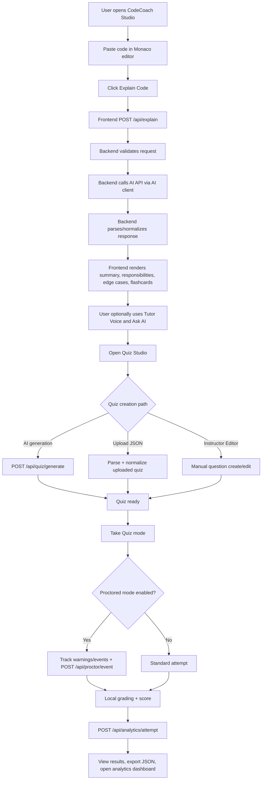

# design.md — CodeCoach Studio

---

# 1. Overview

CodeCoach Studio is a full-stack AI-assisted coding education platform designed to provide a structured, end-to-end learning loop for programming students.

The system enables users to:

- Submit code for structured explanation
- Ask follow-up questions
- Generate or manually create quizzes
- Attempt quizzes (with optional proctored mode)
- Review performance analytics

The architecture follows a client–server model with AI orchestration handled securely on the backend.

---

# 2. System Architecture

## 2.1 High-Level Architecture

User  
│  
▼  
React + TypeScript Frontend  
│  
▼  
Node.js + Express Backend (REST APIs)  
│  
├── AI Service Adapter → External AI API  
└── JSON Datastore (File-based persistence)

## 2.2 Architectural Principles

- Clear separation of frontend and backend
- Backend-only AI key handling
- Structured JSON contracts between layers
- Defensive validation of all AI outputs
- Modular service-based backend design

---

# 3. Technology Stack

## 3.1 Frontend

- React 18+
- TypeScript
- Vite
- Monaco Editor (code input)
- Browser SpeechSynthesis API (Tutor Voice)
- Axios (HTTP communication)

## 3.2 Backend

- Node.js 18+
- Express
- JWT-based authentication
- PBKDF2 password hashing
- File-based JSON datastore

## 3.3 AI Integration

- External AI API (provider-agnostic)
- Timeout handling via AbortController
- Structured JSON parsing and normalization

---

# 4. Core Frontend Modules

## 4.1 App Shell (`App.tsx`)

Responsibilities:

- Code input using Monaco Editor
- Language selection
- Explain workflow
- Error handling and loading states
- Launching Quiz Studio
- Health status indicator

---

## 4.2 Explanation Panel

Displays structured AI output:

- Summary
- Responsibilities
- Edge cases
- Suggested unit tests
- Flashcards
- Key points
- Confidence score

Supports multilingual rendering.

---

## 4.3 Ask AI Mentor Panel

- Follow-up Q&A interface
- Maintains conversation context
- Uses same language preference as explanation

---

## 4.4 Tutor Voice Module (`ChatbotAvatarSync.tsx`)

- Converts transcript to speech
- Supports language-based voice mapping
- Play / Pause / Resume controls
- Graceful fallback if voice unavailable

---

## 4.5 Quiz Studio (`QuizManager.tsx`)

Supports three quiz creation paths:

1. AI-generated quizzes  
2. JSON upload  
3. Instructor manual editor  

Features:

- MCQ / Text / Code questions
- Difficulty levels (Easy / Medium / Hard)
- Optional proctored mode
- Local grading
- Result export (JSON)

---

## 4.6 Analytics Dashboard

Displays:

- Score trends
- Topic performance
- Completion rate
- Time spent metrics

Instructor view supports aggregated statistics.

---

# 5. Backend Modules

## 5.1 API Layer (`backend/index.js`)

Handles:

- Authentication
- Code explanation
- Follow-up questions
- Quiz generation
- Quiz attempts
- Proctor event logging
- Analytics retrieval
- Health checks

All endpoints return JSON.

Standard error format:

```json
{
  "ok": false,
  "code": "ERROR_CODE",
  "message": "User-friendly message",
  "detail": "Optional debug information"
}
```
## 6 . Current Version Flowchart (Frontend-Backend)


