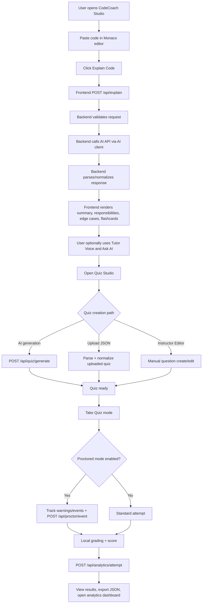

# design.md - CodeCoach Studio

## 1. System Design Summary
CodeCoach Studio follows a client-server architecture for one continuous learning loop:
- Explain code
- Revise with flashcards and tutor voice
- Ask follow-up doubts
- Create/attempt quizzes
- Review scores and analytics

## 2. Tech Stack
- **Frontend:** React + TypeScript + Vite
- **Backend:** Node.js + Express
- **AI Layer:** External AI API (provider-agnostic)
- **Storage:** Local JSON datastore (`backend/data/app-db.json`)

## 3. Core Frontend Modules
### 3.1 App Shell (`codecoach/src/App.tsx`)
- Monaco editor for code input
- Explain flow + error handling
- Ask AI mentor panel
- Flashcards and result sections
- Auth and analytics modals
- Quiz Studio launcher

### 3.2 Quiz Studio (`codecoach/src/components/QuizManager.tsx`)
- **Take Quiz** mode (primary action)
- **Instructor Editor** for manual/custom quiz authoring
- AI quiz generation with topic/type/difficulty/count
- Upload quiz JSON support
- Optional proctored attempt mode
- Local grading + result export

### 3.3 Tutor Voice (`codecoach/src/components/ChatbotAvatarSync.tsx`)
- Speech playback for explanation transcript
- Language-aware voice behavior

## 4. Backend Modules
### 4.1 API Layer (`backend/index.js`)
- Health, auth, profile, explain, ask, grade, quiz generation, analytics, proctor, study-plan endpoints
- Payload checks and consistent error responses

### 4.2 AI Client Layer (`backend/callModel.js`)
- Timeout-aware model calls
- Upstream failure protection

## 5. Runtime Data Flow
1. User pastes code and requests explanation.
2. Frontend calls `/api/explain`.
3. Backend builds prompt, calls AI API, extracts/normalizes JSON.
4. Frontend renders summary, flashcards, mentor Q&A, and voice transcript.
5. User opens Quiz Studio and either:
   - generates quiz with AI,
   - uploads quiz JSON, or
   - builds custom questions in Instructor Editor.
6. User attempts quiz in Take Quiz mode, optionally enables proctored mode, then views score and exports results.

## 6. API Contract Snapshot
- `GET /api/health`
- `POST /api/explain`
- `POST /api/ask`
- `POST /api/grade`
- `POST /api/quiz/generate`
- `POST /api/auth/register`
- `POST /api/auth/login`
- `GET /api/auth/me`
- `PUT /api/profile`
- `POST /api/profile/sync`
- `GET /api/analytics/dashboard`
- `POST /api/analytics/attempt`
- `POST /api/proctor/event`
- `POST /api/study-plan`

## 7. Reliability and Error Design
- `AbortController` timeout for long AI calls
- `tryExtractJson` fallback extraction for noisy model outputs
- Quiz normalization before UI rendering
- Standard error shape:
```json
{ "ok": false, "code": "...", "message": "...", "detail": "..." }
```

## 8. Security Design
- AI API key remains backend-only (`backend/.env`)
- Password hashing via PBKDF2 + unique salt
- HMAC-signed bearer token auth
- Protected profile/analytics/proctor routes

## 9. UX Design Decisions
- Keep workflow simple: Explain -> Revise -> Ask -> Quiz -> Score
- Surface quiz creation options clearly: AI, upload JSON, Instructor Editor
- Keep proctored mode optional and visible in Take Quiz mode
- Maintain dark/light support and readable hierarchy

## 10. Deployment Configuration
### Backend env (generic naming)
- `AI_API_KEY`
- `AI_MODEL`
- `AI_TIMEOUT_MS`
- `AUTH_SECRET`
- `PORT`

### Frontend env
- `VITE_API_BASE_URL`

## 11. Prompt for Architecture Diagram Generation
Use this prompt in Mermaid-compatible tools or diagram assistants:

"Draw a professional architecture diagram for CodeCoach Studio.

System context:
- User interacts with a React + TypeScript frontend.
- Frontend calls backend APIs for explain, ask, quiz generation, grading, health, auth, profile sync, analytics, proctor events, and study plan.
- Backend (Node.js + Express) validates payloads, handles auth, logs analytics/proctor events, and orchestrates AI requests.
- Backend AI client sends prompt requests to an external AI API and returns parsed/normalized responses.
- Frontend modules include Monaco Editor, Tutor Voice (SpeechSynthesis), Results panel, Ask AI panel, and Quiz Studio.
- Quiz Studio supports Take Quiz mode, Instructor Editor, AI generation, JSON upload, optional proctored attempt mode, local grading, and result export.
- Data store is a local JSON database used for users, profile data, attempts, and proctor logs.

Diagram requirements:
- Use clear boxes for User, Frontend, Backend, AI API, and Data Store.
- Show key API connections with labeled arrows.
- Keep AI provider name generic as 'AI API'.
- Keep layout clean and suitable for judge/demo presentation." 

## 12. Current Version Flowchart (Frontend-Backend)


## 13. Estimated Implementation Cost
### 13.1 One-Time Development (Typical Ranges)
- Student/team self-implementation: low direct cost, primarily effort/time.
- Small professional build (8-12 weeks): **USD 12,000 to USD 45,000**.
- Production-depth build with stronger QA/devops: **USD 45,000 to USD 120,000**.

### 13.2 Monthly Operating Cost (MVP)
- AI API usage: **USD 20 to USD 300+**.
- Backend hosting/storage/monitoring: **USD 15 to USD 120**.
- Domain/misc tools: **USD 2 to USD 30**.
- Typical monthly total: **USD 40 to USD 450+**.

### 13.3 Assumptions
- Cost depends on active users, token usage, and request frequency.
- Proctored logging adds moderate storage/event traffic.
- Estimates are planning ranges, not fixed quotes.
