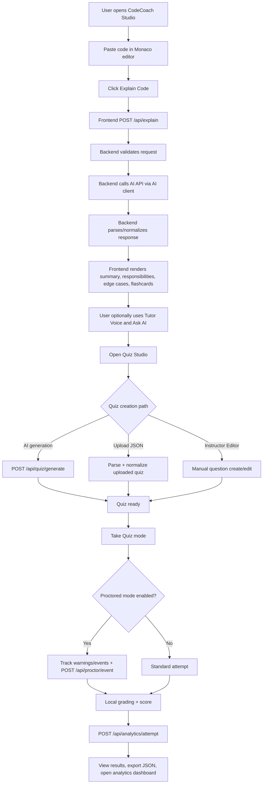

## 1. System Design Summary

CodeCoach Studio follows a client-server architecture implementing a structured AI-powered learning loop:

Explain code

Revise with flashcards and tutor voice

Ask follow-up questions

Create or generate quizzes

Attempt quiz

Score and review analytics

## 2. High-Level Architecture

User -> Frontend (React + TypeScript) -> Backend (Node.js + Express) -> AI API

Data storage:

Local JSON datastore (backend/data/app-db.json)

## 3. Tech Stack

Frontend: React + TypeScript + Vite

Backend: Node.js + Express

AI Layer: External AI API (provider-agnostic)

Storage: Local JSON datastore

Speech: Browser SpeechSynthesis API

## 4. Frontend Modules

### 4.1 App Shell (App.tsx)

Monaco code editor

Explain flow orchestration

Ask AI panel

Flashcards and result panels

Quiz Studio launcher

Error banner + backend health badge

### 4.2 Quiz Studio (QuizManager.tsx)

Take Quiz mode

Instructor Editor

AI quiz generation

JSON upload

Optional proctored mode

Local grading and export

### 4.3 Tutor Voice (ChatbotAvatarSync.tsx)

Transcript playback

Language-aware voice selection

Playback controls

## 5. Backend Modules

### 5.1 API Layer (index.js)

Handles:

Health check

Explain

Ask

Grade

Quiz generation

Auth/profile (if enabled)

Analytics

Proctor event logging

Includes:

Payload validation

Consistent error response format

### 5.2 AI Client Layer (callModel.js)

Sends prompt to AI API

Implements timeout protection

Extracts and returns raw model output

## 6. Runtime Data Flow

User submits code.

Frontend calls /api/explain.

Backend builds prompt and calls AI.

Backend extracts structured JSON.

Frontend renders summary, flashcards, and transcript.

User opens Quiz Studio:

AI generates quiz OR

Uploads JSON OR

Creates manually.

User attempts quiz.

Optional proctor events logged.

Score computed locally.

Analytics stored.

## 7. API Contract Snapshot

GET /api/health

POST /api/explain

POST /api/ask

POST /api/grade

POST /api/quiz/generate

POST /api/proctor/event

POST /api/analytics/attempt

(Additional auth/profile endpoints optional based on deployment mode.)

## 8. Reliability & Error Design

Timeout via AbortController

JSON extraction via tryExtractJson

Quiz normalization before UI rendering

Standard error response format:

```json
{
  "ok": false,
  "code": "ERROR_CODE",
  "message": "User-friendly message",
  "detail": "Technical detail"
}
```

## 9. Security Design

AI API key stored only in backend .env

No secret exposure in frontend

Optional bearer token authentication

Proctor events validated server-side

## 10. UX Design Principles

Linear learning progression

Structured outputs instead of raw chat

Clear quiz creation pathways

Optional proctor mode visibility

Minimal cognitive overload

## 11. Deployment Configuration

Backend Environment Variables

AI_API_KEY

AI_MODEL

AI_TIMEOUT_MS

AUTH_SECRET

PORT

Frontend Environment

VITE_API_BASE_URL

## 12. Cost Estimation (Planning Range)

One-Time Development

Small team: USD 12,000 - 45,000

Production-grade build: USD 45,000 - 120,000

Monthly MVP Cost

AI usage: USD 20 - 300+

Hosting/storage: USD 15 - 120

Miscellaneous: USD 2 - 30

Typical range: USD 40 - 450+

## 12. Current Version Flowchart (Frontend-Backend)


