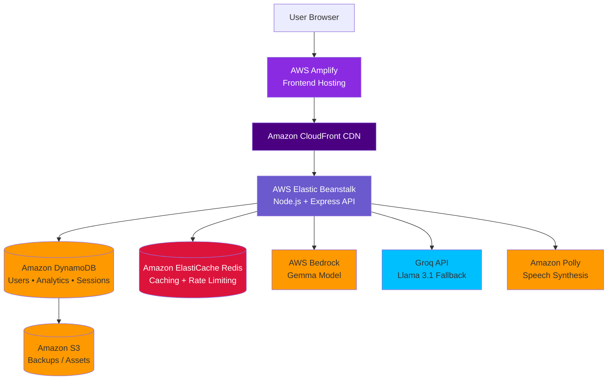
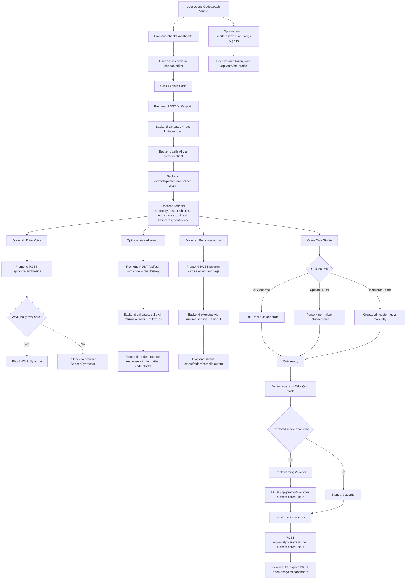

# Design Document: 

## Introduction

 CodeCoachStudiois an AI-powered platform that explains code in simple, multilinguallanguage and guides learners step-by-step.
 
-  It combinescode explanation, doubt-solving, flashcard revision, and quiz practice in one unified studio.
-  Instructors and students can generate, upload, or manually create quizzes with instant scoring and optional proctored mode.
-  The goal is to improve "concept clarity, revision, and interview readiness" through interactive, AI-assisted learning.

## Overview

This design outlines the migration from a file-based JSON database to a production-ready serverless architecture using Amazon DynamoDB for persistent storage and Amazon ElastiCache(Redis/Valkey) for distributed caching and rate limiting. The migration maintains complete backward compatibility with existing API contracts while eliminating race conditions, enabling horizontal scaling, and improving performance under load.

The architecture follows a cloud-native approach using managed AWS services:

- **Frontend Layer**: React application hosted on AWS Amplify
- **Application Layer**: Node.js + Express backend deployed on AWS Elastic Beanstalk
- **AI Layer**: AWS Bedrock (Gemma) with Groq as a fallback inference provider
- **Data Layer**: Amazon DynamoDB for scalable storage of users, sessions, and analytics
- **Cache Layer**: Amazon ElastiCache (Redis/Valkey) for response caching and distributed rate limiting
- **Voice Layer**: Amazon Polly for optional speech synthesis of explanations
## Architecture

### High-Level Architecture

```mermaid
graph TB

    USER[User Browser]

    AMP[AWS Amplify<br>Frontend Hosting]

    CF[Amazon CloudFront CDN]

    EB[AWS Elastic Beanstalk<br>Node.js + Express API]

    DDB[(Amazon DynamoDB<br>Users • Analytics • Sessions)]

    RD[(Amazon ElastiCache Redis<br>Caching + Rate Limiting)]

    BR[AWS Bedrock<br>Gemma Model]

    GQ[Groq API<br>Llama 3.1 Fallback]

    PL[Amazon Polly<br>Speech Synthesis]

    S3[(Amazon S3<br>Backups / Assets)]

    USER --> AMP
    AMP --> CF
    CF --> EB

    EB --> DDB
    EB --> RD

    EB --> BR
    EB --> GQ

    EB --> PL

    DDB --> S3

    style AMP fill:#8A2BE2,color:#fff
    style EB fill:#6A5ACD,color:#fff
    style CF fill:#4B0082,color:#fff
    style DDB fill:#FF9900
    style RD fill:#DC143C,color:#fff
    style BR fill:#FF9900
    style GQ fill:#00BFFF
    style PL fill:#FF9900
    style S3 fill:#FF9900
```

### Data Flow

#### Write Operations

1. User sends a request from the web application hosted on **AWS Amplify**
2. Request passes through **Amazon CloudFront CDN**
3. Request reaches the **Elastic Beanstalk backend API (Node.js + Express)**
4. Backend checks **rate limits using Redis (ElastiCache)**
5. Request data is validated and sanitized
6. If AI processing is required, the backend calls:
   - **AWS Bedrock (Gemma)** for code explanation or quiz generation
   - **Groq API** as a fallback inference provider
7. Processed data is stored in **Amazon DynamoDB**
8. Cache entries in **Redis** are updated or invalidated
9. Response is returned to the client through CloudFront

---

#### Read Operations

1. User request originates from the **Amplify-hosted frontend**
2. Request is routed through **CloudFront CDN**
3. Request reaches the **Elastic Beanstalk API**
4. Backend checks **Redis cache**
5. If cache hit → return cached response immediately
6. If cache miss:
   - Query **DynamoDB** for stored data
7. Retrieved data is cached in **Redis**
8. Response is returned to the user

---

#### AI Processing Flow

1. User submits code for explanation or asks a tutoring question
2. Backend prepares a structured prompt
3. AI inference is requested from:
   - **AWS Bedrock (Gemma)** as the primary model
   - **Groq (Llama 3.1)** as fallback
4. AI response is processed into structured output:
   - Summary
   - Key concepts
   - Edge cases
   - Flashcards
5. Optional **Amazon Polly** voice synthesis generates audio explanations
6. Final response is returned to the frontend

---

#### Analytics Tracking

1. User completes a quiz attempt
2. Backend calculates the score and metadata
3. Results are stored in the **DynamoDB Analytics table**
4. User progress metrics are updated
5. Analytics dashboard reads aggregated results from DynamoDB

###FLOWCHART:

```mermaid
flowchart TD
  A[User opens CodeCoach Studio] --> B[Frontend checks /api/health]
  B --> C[User pastes code in Monaco editor]
  C --> D[Click Explain Code]
  D --> E[Frontend POST /api/explain]
  E --> F[Backend validates + rate-limits request]
  F --> G[Backend calls AI via provider client]
  G --> H[Backend extracts/parses/normalizes JSON]
  H --> I[Frontend renders summary, responsibilities, edge cases, unit test, flashcards, confidence]

  I --> J[Optional: Tutor Voice]
  J --> K[Frontend POST /api/voice/synthesize]
  K --> L{AWS Polly available?}
  L -->|Yes| M[Play AWS Polly audio]
  L -->|No| N[Fallback to browser SpeechSynthesis]

  I --> O[Optional: Ask AI Mentor]
  O --> P[Frontend POST /api/ask with code + chat history]
  P --> Q[Backend validates, calls AI, returns answer + followups]
  Q --> R[Frontend renders mentor response with formatted code blocks]

  I --> S[Optional: Run code output]
  S --> T[Frontend POST /api/run with selected language]
  T --> U[Backend executes via runtime service + timeout]
  U --> V[Frontend shows stdout/stderr/compile output]

  I --> W[Open Quiz Studio]
  W --> X{Quiz source}
  X -->|AI Generate| Y[POST /api/quiz/generate]
  X -->|Upload JSON| Z[Parse + normalize uploaded quiz]
  X -->|Instructor Editor| AA[Create/edit custom quiz manually]

  Y --> AB[Quiz ready]
  Z --> AB
  AA --> AB

  AB --> AC[Default opens in Take Quiz mode]
  AC --> AD{Proctored mode enabled?}
  AD -->|Yes| AE[Track warnings/events]
  AE --> AF[POST /api/proctor/event for authenticated users]
  AD -->|No| AG[Standard attempt]

  AF --> AH[Local grading + score]
  AG --> AH
  AH --> AI[POST /api/analytics/attempt for authenticated users]
  AI --> AJ[View results, export JSON, open analytics dashboard]

  A --> AK[Optional auth: Email/Password or Google Sign-In]
  AK --> AL[Receive auth token, load /api/auth/me profile]
```

### Components and Interfaces

**DynamoDB Module**

Responsible for handling database operations such as:

- Retrieving user data
- Storing analytics events
- Managing session records

Uses the AWS SDK DynamoDB Document Client with retry strategies and conditional writes.

---

**Redis Cache Layer**

Provides caching and distributed rate limiting using Amazon ElastiCache.

Functions include:

- Caching user profiles
- Caching analytics dashboards
- Rate limiting API requests

---

**User Repository**

Encapsulates user-related data access logic.

Responsibilities include:

- Finding users by email or ID
- Creating new users
- Updating profile and analytics data
- Managing cache invalidation

### Health Check Endpoint

The backend exposes `/api/health` which verifies the status of:

- DynamoDB connectivity
- Redis cache availability
- AI provider configuration

This endpoint is used by monitoring systems and deployment platforms.

### DynamoDB Tables

**Users Table**

Stores user profile and authentication data.

Key attributes:

- `userId` (Partition Key)
- `email`
- `profile`
- `analytics`
- `createdAt`
- `updatedAt`

A Global Secondary Index on `email` allows quick lookup during login.

---

**Analytics Table**

Tracks user activity events such as:

- quiz attempts
- questions asked
- code execution events

Primary key structure:

- `userId` (Partition Key)
- `timestamp` (Sort Key)

### Redis Key Patterns

Used for caching and rate limiting.

Examples:

ratelimit:ai:{ip}
user:id:{userId}
analytics:dashboard:{userId}

## System Reliability Considerations

The system includes several mechanisms to ensure reliability and consistency.

### Concurrent Writes
DynamoDB conditional writes prevent duplicate user registrations and ensure safe updates.

### Rate Limiting
Redis-based rate limiting prevents API abuse and protects backend resources.

### Cache Consistency
Redis cache entries are invalidated whenever user data is updated in DynamoDB to ensure fresh reads.

### Graceful Degradation
If Redis becomes unavailable, the application continues operating without caching rather than failing.

### Environment Validation
The server validates required environment variables at startup to prevent misconfiguration.

### Secure Authentication
Passwords are hashed using bcrypt to protect user credentials.

## Error Handling

### DynamoDB Errors
- ConditionalCheckFailedException → return **409 Conflict** (duplicate registration)
- ValidationException → return **400 Bad Request**
- ResourceNotFoundException → return **503 Service Unavailable**
- Network errors → retried automatically by AWS SDK with exponential backoff

### Redis Errors
If Redis becomes unavailable:
- caching is skipped
- rate limiting falls back to application logic
- requests continue processing

### Authentication Errors
- Invalid credentials → **401 Unauthorized**
- Expired tokens → **401 Unauthorized**
- Hashing errors → **500 Internal Server Error**

### AI Service Errors
- Bedrock throttling → retry with exponential backoff
- Polly errors → fallback to browser speech synthesis

## Testing Strategy

### Unit Testing
Unit tests verify core application modules including:

- DynamoDB data access operations
- Redis caching functions
- User repository operations
- Rate limiting logic
- Authentication utilities
- Environment configuration validation

### Integration Testing
Integration tests validate interactions between system components:

- User registration and login flow
- Quiz generation and grading
- AI explanation responses
- Cache hit and miss scenarios
- Redis fallback behavior

### Load Testing
Basic load testing ensures the system can handle multiple concurrent users.

Test scenarios include:

- 100+ concurrent requests
- sustained traffic for several minutes
- measurement of response latency and cache efficiency

### Post-Migration Validation

1. Test user registration and login
2. Test Google OAuth flow
3. Test AI code explanation endpoint
4. Test voice synthesis endpoint
5. Test code execution endpoint
6. Verify rate limiting across multiple requests
7. Check CloudWatch logs for errors
8. Monitor DynamoDB metrics (read/write capacity, throttling)
9. Monitor Redis metrics (hit rate, memory usage)
10. Run load tests to verify performance

